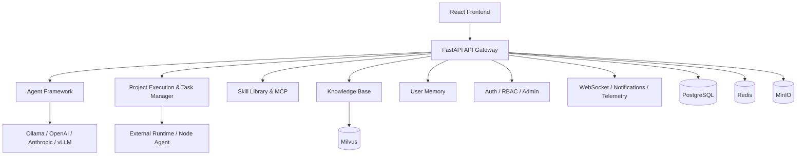

# LinX · 灵枢

<div align="center">
  

  [](LICENSE)
  [](https://www.python.org/)
  [](https://fastapi.tiangolo.com/)
  [](https://react.dev/)
  [](https://www.docker.com/)
  [](https://github.com/asmoyou/LinX/actions/workflows/backend-tests.yml)
  [](https://github.com/asmoyou/LinX/actions/workflows/frontend-tests.yml)
  [](https://github.com/asmoyou/LinX/actions/workflows/security-scan.yml)
</div>

> 面向多智能体协作、项目执行、知识检索、记忆管理、技能编排与外部运行节点接入的智能协作平台。

LinX（灵枢）是一套已经完成较多实际功能开发的全栈平台，目标不是“单个聊天机器人页面”，而是把 **智能体、项目、任务、知识、记忆、技能、调度与外部执行环境** 连接起来，形成可持续扩展的 AI 协作系统。

- English overview: [`README_EN.md`](README_EN.md)
- 授权说明：[`LICENSE`](LICENSE)

当前仓库已经包含：
- 完整的前后端实现：`FastAPI + React + TypeScript`
- 多模块后端：智能体框架、项目执行、技能库、知识库、用户记忆、调度、监控、权限等
- 可运行的本地开发栈：`PostgreSQL`、`Redis`、`Milvus`、`MinIO`、`Docker Compose`
- 面向真实使用场景的 UI：项目中心、运行中心、智能体对话、知识管理、技能中心、用户与角色管理等
- 可选的外部运行节点能力：支持把执行任务下发到外部主机上的 `node-agent`

## 目录

- [为什么是 LinX](#为什么是-linx)
- [核心能力](#核心能力)
- [架构概览](#架构概览)
- [技术栈](#技术栈)
- [快速开始](#快速开始)
- [本地开发](#本地开发)
- [配置说明](#配置说明)
- [项目结构](#项目结构)
- [文档导航](#文档导航)
- [适用场景](#适用场景)
- [授权说明](#授权说明)
- [贡献](#贡献)

## 为什么是 LinX

很多 AI 项目只解决了“调用模型”和“展示回答”两个问题，但在实际协作里还会遇到：
- 智能体如何被组织、分工、调度与追踪
- 项目如何拆解为任务、执行计划与运行记录
- 知识和记忆如何被沉淀、检索、复用
- 技能如何沉淀为可安装、可绑定、可测试的能力资产
- 外部主机、沙箱和运行时如何安全接入平台
- 团队成员、角色、权限、通知和设置如何一起工作

LinX 的定位，就是把这些系统性能力整合到一个持续演进的平台里。

## 核心能力

### 1. 多智能体协作与持久化对话
- 智能体创建、配置、测试、日志与运行指标管理
- 持久化对话页面，支持长历史、Markdown 渲染、附件与工作区文件
- 技能绑定、知识检索、用户记忆等能力按运行时注入智能体
- 支持外部运行时和会话工作区归档下载

### 2. 项目执行平台
- 项目、项目任务、执行计划、运行记录、运行步骤完整闭环
- `Run Center` / `Run Detail` 用于查看路由、时间线、交付物与外部会话
- 支持执行节点、租约分发、外部 Agent 会话与项目空间同步

### 3. 技能库与 MCP 扩展
- 技能创建、编辑、测试、版本管理、文件编辑与包导入
- 技能候选项审核、合并、拒绝与绑定管理
- 内建 `SKILL.md` 风格技能体系，同时兼容 LangChain Tool 风格能力
- 支持 `MCP Server` 管理、同步与工具接入

### 4. 知识库与用户记忆
- 文档上传、下载、重处理、检索、预览、配置测试
- 文档处理链路覆盖解析、切块、增强、索引
- 知识检索结合向量检索与关系型搜索能力
- 用户记忆支持搜索、配置、检索测试与多维查看

### 5. 调度、通知与平台管理
- 定时任务创建、编辑、暂停、恢复、立即执行与详情查看
- 仪表盘、通知中心、部门管理、用户管理、角色权限管理
- 设置中心支持平台基础配置、体验配置、LLM 与环境变量相关能力
- 个人资料页支持安全、偏好、配额、API Key、会话与隐私相关操作

### 6. 部署、安全与可观测性
- `Docker Compose` 一键启动本地/测试环境
- 后端内置 JWT、请求日志、中间件、限流与健康检查
- 支持 Docker 沙箱代码执行与外部运行节点机制
- 具备 Redis、MinIO、Milvus、PostgreSQL 等基础设施集成

## 架构概览



更详细的系统设计见：[`docs/architecture/system-architecture.md`](docs/architecture/system-architecture.md)

## 技术栈

**后端**
- `FastAPI`、`SQLAlchemy`、`Alembic`
- `LangChain` / 自定义 Agent Framework
- `PostgreSQL`、`Redis`、`Milvus`、`MinIO`
- `Docker` 沙箱、WebSocket、监控与可观测性相关模块

**前端**
- `React 19`、`TypeScript`、`Vite`
- `Zustand` 状态管理
- `Tailwind CSS v4`、`Framer Motion`
- `Recharts`、`React Flow`、`Monaco Editor`
- `react-markdown`、`docx-preview`、`AG Grid`、`xlsx`

**基础设施**
- `Docker Compose`
- 可选 `Kubernetes`
- 可选外部运行节点：`node-agent/`

## 快速开始

### 方式一：使用 Docker Compose（推荐）

适合第一次快速体验整个平台。

#### 1）准备环境
- Docker `24+`
- Docker Compose `2.20+`
- 建议至少 `8 GB` 内存

#### 2）复制环境变量

```bash
cp .env.example .env
```

最少建议检查这些变量：
- `POSTGRES_PASSWORD`
- `REDIS_PASSWORD`
- `MINIO_ROOT_PASSWORD`
- `JWT_SECRET`
- `OLLAMA_BASE_URL` 或云端模型密钥

#### 3）启动服务

```bash
docker compose up -d
```

#### 4）访问系统
- 前端：`http://localhost:3000`
- 后端 API：`http://localhost:8000`
- Swagger 文档：`http://localhost:8000/docs`
- MinIO Console：`http://localhost:9001`

首次打开前端时，如果系统尚未初始化，会进入 `Setup` 页面创建第一个管理员账号与基础平台设置。

### 方式二：后端 / 前端分开本地开发

适合日常开发与调试。

## 本地开发

### 后端

请始终使用项目内虚拟环境 `backend/.venv`。

```bash
cd backend
python3 -m venv .venv
.venv/bin/pip install -r requirements.txt
.venv/bin/pip install -r requirements-dev.txt
.venv/bin/python scripts/dev_server.py preflight
make run
```

常用命令：

```bash
cd backend
source .venv/bin/activate
make run
make run-debug
make format
make lint
make type-check
make test
make test-cov
make migrate
```

### 前端

```bash
cd frontend
npm install
npm run dev
```

常用命令：

```bash
cd frontend
npm run lint
npm run type-check
npm run format
npm run test
npm run build
```

### 可选：外部运行节点

如果你希望把任务执行到独立主机上，可以查看：
- [`node-agent/README.md`](node-agent/README.md)

## 配置说明

### 1. 环境变量
根目录的 [`.env.example`](.env.example) 提供了本地开发和容器部署的常用配置项，包括：
- 数据库与缓存：`PostgreSQL`、`Redis`
- 向量与对象存储：`Milvus`、`MinIO`
- 模型提供方：`Ollama`、`OpenAI`、`Anthropic`
- 安全配置：`JWT_SECRET`、加密密钥、CORS
- 沙箱与文档处理配置

### 2. 后端配置
- 参考模板：[`backend/config.yaml.example`](backend/config.yaml.example)
- 实际运行配置：`backend/config.yaml`

### 3. 前端配置
前端使用 Vite，环境变量需采用 `VITE_*` 前缀。

### 4. 部署文档
- Docker Compose：[`docs/deployment/docker-compose-deployment.md`](docs/deployment/docker-compose-deployment.md)
- 安装指南：[`docs/deployment/installation-guide.md`](docs/deployment/installation-guide.md)
- Kubernetes：[`docs/deployment/kubernetes-deployment.md`](docs/deployment/kubernetes-deployment.md)
- 生产检查清单：[`docs/deployment/production-readiness-checklist.md`](docs/deployment/production-readiness-checklist.md)

## 项目结构

```text
.
├── backend/               # FastAPI 后端、Agent Framework、项目执行、知识与记忆系统
├── frontend/              # React + TypeScript 前端
├── node-agent/            # 外部运行节点客户端
├── docs/                  # 架构、后端、开发、部署、用户文档
├── infrastructure/        # Docker / Kubernetes 等部署相关资源
├── docker-compose.yml     # 本地 / 测试环境编排
├── .env.example           # 环境变量模板
├── LICENSE                # 双许可证说明（MIT OR Apache-2.0）
├── LICENSE-MIT            # MIT 许可证全文
└── LICENSE-APACHE         # Apache License 2.0 全文
```

后端主要模块：
- `api_gateway/`：API、WebSocket、路由与中间件
- `agent_framework/`：智能体运行框架与会话能力
- `task_manager/`：任务协调、分解与执行链路
- `knowledge_base/`：文档处理、知识检索
- `user_memory/` / `memory_system/`：用户记忆与记忆系统
- `skill_library/`：技能注册、包处理、模板与测试
- `llm_providers/`：模型提供方接入与路由
- `project_execution/`：项目执行与运行中心后端能力

前端主要页面：
- `Projects` / `Project Detail`
- `Run Center` / `Run Detail`
- `Workforce` / `Agent Conversation`
- `Knowledge` / `Memory`
- `Skills`
- `Schedules`
- `Dashboard`
- `Departments` / `User Management` / `Role Management`
- `Settings` / `Profile` / `Notifications`

## 文档导航

### 架构与系统设计
- [`docs/architecture/system-architecture.md`](docs/architecture/system-architecture.md)

### 后端实现
- [`docs/backend/`](docs/backend/)
- [`docs/api/api-documentation.md`](docs/api/api-documentation.md)
- [`docs/api/frontend-integration-guide.md`](docs/api/frontend-integration-guide.md)

### 开发与测试
- [`CLAUDE.md`](CLAUDE.md)
- [`CONTRIBUTING.md`](CONTRIBUTING.md)
- [`docs/developer/developer-guide.md`](docs/developer/developer-guide.md)
- [`docs/developer/testing-guide.md`](docs/developer/testing-guide.md)
- [`docs/developer/frontend-setup.md`](docs/developer/frontend-setup.md)

### 部署与运维
- [`docs/deployment/`](docs/deployment/)
- [`infrastructure/docker/README.md`](infrastructure/docker/README.md)

### 用户侧文档
- [`docs/user-guide/`](docs/user-guide/)

## 适用场景

LinX 适合以下场景：
- 多智能体协作平台原型与产品化探索
- 需要“项目执行 + 智能体 + 知识库 + 记忆”统一工作台的团队
- 本地私有化 AI 工作流实验环境
- 需要外部节点执行任务的 AI 平台
- 面向企业内部协作、运营辅助、知识处理、自动化执行的系统原型

## 授权说明

LinX 现在采用 **双许可证（MIT OR Apache-2.0）** 发布，完整条款见：
- [`LICENSE`](LICENSE)
- [`LICENSE-MIT`](LICENSE-MIT)
- [`LICENSE-APACHE`](LICENSE-APACHE)

这意味着你可以根据自己的使用场景，自行选择以下任一许可证来使用、修改和分发本项目：
- `MIT`：更简洁宽松
- `Apache-2.0`：包含更明确的专利授权条款

仓库已移除商业报备与收费要求，当前为标准 OSI 开源许可证发布方式。

## 贡献

欢迎提交 Issue、PR 和改进建议。

建议贡献前先阅读：
- [`AGENTS.md`](AGENTS.md)
- [`CLAUDE.md`](CLAUDE.md)
- [`CONTRIBUTING.md`](CONTRIBUTING.md)

如果你的改动涉及：
- 后端：请尽量补充或更新 `pytest` 测试
- 前端：请同步更新相关类型、状态和页面行为
- 文档：请优先保持 README 与 `docs/` 的一致性

## 致谢

感谢所有关注、试用和参与 LinX 的开发者。项目仍在持续演进中，欢迎一起把它打磨成一个真正可落地的智能协作平台。
