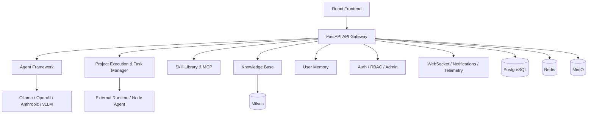

# LinX · 灵枢

<div align="center">
  

  [](LICENSE)
  [](https://www.python.org/)
  [](https://fastapi.tiangolo.com/)
  [](https://react.dev/)
  [](https://www.docker.com/)
  [](https://github.com/asmoyou/LinX/actions/workflows/backend-tests.yml)
  [](https://github.com/asmoyou/LinX/actions/workflows/frontend-tests.yml)
  [](https://github.com/asmoyou/LinX/actions/workflows/security-scan.yml)
</div>

> An intelligent collaboration platform for multi-agent orchestration, project execution, knowledge retrieval, memory management, skill composition, and external runtime integration.

LinX is a full-stack platform that goes beyond a single chat UI. It connects **agents, projects, tasks, knowledge, memory, skills, scheduling, and execution environments** into one extensible AI collaboration workspace.

- Chinese README: [`README.md`](README.md)
- License details: [`LICENSE`](LICENSE)

## What’s in the repo

- Full-stack implementation with `FastAPI + React + TypeScript`
- Multi-module backend for agent orchestration, project execution, skills, knowledge, memory, scheduling, monitoring, and access control
- Local development stack powered by `PostgreSQL`, `Redis`, `Milvus`, `MinIO`, and `Docker Compose`
- User-facing product surfaces for projects, runs, agent conversations, knowledge management, skills, schedules, settings, and admin operations
- Optional external runtime support through the `node-agent/` package

## Core capabilities

### Agent orchestration
- Agent creation, configuration, testing, logs, and runtime metrics
- Persistent conversations with Markdown rendering, attachments, and workspace files
- Runtime access to skills, knowledge, and user memory
- Support for external runtimes and archived session workspaces

### Project execution
- End-to-end flows for projects, project tasks, execution plans, runs, and run steps
- `Run Center` and `Run Detail` pages for routing, timelines, deliverables, and external sessions
- Execution nodes, lease dispatch, and project workspace sync support

### Skills and extensions
- Skill creation, editing, testing, versioning, package import, and bindings
- Candidate review / merge / reject workflows
- `SKILL.md`-style skills plus LangChain-style tool integrations
- `MCP Server` management and tool synchronization

### Knowledge and memory
- Document upload, download, reprocessing, preview, search, and retrieval testing
- Processing pipeline for parsing, chunking, enrichment, and indexing
- User memory search, configuration, retrieval testing, and detail views

### Platform operations
- Schedules with create, edit, pause, resume, run-now, and detail views
- Dashboard, notifications, departments, users, roles, settings, and profile management
- JWT auth, request logging, rate limiting, health checks, and Docker-based sandbox execution

## Architecture



Detailed architecture: [`docs/architecture/system-architecture.md`](docs/architecture/system-architecture.md)

## Tech stack

**Backend**
- `FastAPI`, `SQLAlchemy`, `Alembic`
- `LangChain` plus custom agent framework
- `PostgreSQL`, `Redis`, `Milvus`, `MinIO`
- WebSocket, monitoring, and Docker sandbox integrations

**Frontend**
- `React 19`, `TypeScript`, `Vite`
- `Zustand`
- `Tailwind CSS v4`, `Framer Motion`
- `Recharts`, `React Flow`, `Monaco Editor`

**Infrastructure**
- `Docker Compose`
- Optional `Kubernetes`
- Optional external runtime hosts via `node-agent/`

## Quick start

### Option 1: Docker Compose

Recommended for first-time setup.

#### Requirements
- Docker `24+`
- Docker Compose `2.20+`
- Recommended memory: `8 GB+`

#### 1) Copy environment variables

```bash
cp .env.example .env
```

Review at least:
- `POSTGRES_PASSWORD`
- `REDIS_PASSWORD`
- `MINIO_ROOT_PASSWORD`
- `JWT_SECRET`
- `OLLAMA_BASE_URL` or cloud model credentials

#### 2) Start services

```bash
docker compose up -d
```

#### 3) Open the platform
- Frontend: `http://localhost:3000`
- Backend API: `http://localhost:8000`
- Swagger docs: `http://localhost:8000/docs`
- MinIO Console: `http://localhost:9001`

If the system is not initialized yet, the frontend will guide you through the first-run setup flow.

### Option 2: Local backend/frontend development

#### Backend

Please use the project virtual environment at `backend/.venv`.

```bash
cd backend
python3 -m venv .venv
.venv/bin/pip install -r requirements.txt
.venv/bin/pip install -r requirements-dev.txt
.venv/bin/python scripts/dev_server.py preflight
make run
```

Common commands:

```bash
cd backend
source .venv/bin/activate
make run
make run-debug
make format
make lint
make type-check
make test
make test-cov
make migrate
```

#### Frontend

```bash
cd frontend
npm install
npm run dev
```

Common commands:

```bash
cd frontend
npm run lint
npm run type-check
npm run format
npm run test
npm run build
```

#### Optional: external runtime host

See: [`node-agent/README.md`](node-agent/README.md)

## Configuration

- Environment template: [`.env.example`](.env.example)
- Backend config template: [`backend/config.yaml.example`](backend/config.yaml.example)
- Backend runtime config: `backend/config.yaml`
- Deployment docs: [`docs/deployment/`](docs/deployment/)

## Project structure

```text
.
├── backend/               # FastAPI backend and platform modules
├── frontend/              # React + TypeScript frontend
├── node-agent/            # External runtime host package
├── docs/                  # Architecture, backend, developer, and deployment docs
├── infrastructure/        # Docker / Kubernetes resources
├── docker-compose.yml     # Local / test stack
├── LICENSE                # Dual-license overview (MIT OR Apache-2.0)
├── LICENSE-MIT            # MIT license text
└── LICENSE-APACHE         # Apache License 2.0 text
```

## License

LinX is dual-licensed under `MIT` or `Apache-2.0` at your option. See [`LICENSE`](LICENSE), [`LICENSE-MIT`](LICENSE-MIT), and [`LICENSE-APACHE`](LICENSE-APACHE).

## Contributing

Please read:
- [`AGENTS.md`](AGENTS.md)
- [`CLAUDE.md`](CLAUDE.md)
- [`CONTRIBUTING.md`](CONTRIBUTING.md)

We’re happy to receive issues, pull requests, and documentation improvements.
