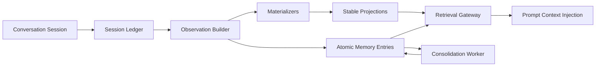

# Memory System V2 Migration Plan

## Purpose

This document defines the migration from the current `memory_records + metadata.facts` architecture
to a layered memory system inspired by SimpleMem, but adapted for linX's requirements:

- PostgreSQL remains the source of truth.
- Milvus remains a vector index, not the business database.
- Session history becomes a first-class ledger.
- Long-term memory is built from atomic observations, not only from ad-hoc string facts.
- Agent memory focuses on reusable successful paths and execution experience, not generic SOP text.

## Why We Are Migrating

The current system centralizes too many concerns inside
[MemorySystem](/Users/youqilin/VIbeCodingProjects/linX/backend/memory_system/memory_system.py):

- fact extraction
- dedupe and merge
- write planning
- ranking and rerank
- Milvus synchronization
- retention and eviction
- compatibility shaping for UI

This causes recurring issues:

- semantically duplicated memories with different keys
- prompt-driven extraction leaking directly into storage shape
- different retrieval behavior between API and runtime paths
- heavy dependence on `metadata` conventions
- difficult evolution of agent memory beyond `interaction.sop.*`

## Target Architecture

## Core Layers

### 1. Session Ledger

Capture what actually happened in a session:

- session metadata
- ordered user/assistant/tool/file events
- timestamps
- extraction provenance

This layer is append/replace oriented and should not decide long-term memory value by itself.

### 2. Observation Builder

Extract reusable, session-independent observations from the ledger:

- user preference/profile facts
- agent successful paths
- decisions
- discoveries
- constraints
- recurring environment fixes

Each observation must have:

- a stable key
- confidence
- importance
- provenance back to the session and event indexes

### 3. Materializers

Project observations into stable read models:

- `user_profile`
- `agent_experience`
- later: `company_playbook`, `task_pattern`, `tool_failure_catalog`

These are the views that should power personalization and experience reuse.

### 4. Retrieval Gateway

All runtime and API retrieval should converge on one path:

- scope filtering
- ACL enforcement
- semantic retrieval
- keyword retrieval
- structured retrieval
- rerank
- token-budgeted context bundle assembly

### 5. Consolidation Worker

Periodic maintenance:

- decay stale entries
- merge near-duplicates
- mark superseded materializations
- keep projections compact and explainable

## What We Copy From SimpleMem

- session history and long-term memory are not the same thing
- atomic context-independent memory units
- provenance-aware observations
- separate write/build/retrieve/consolidate stages
- token-budgeted context injection

## What We Explicitly Do Not Copy

- over-reliance on multi-round LLM retrieval planning
- storage-engine-driven architecture decisions
- pretending prompt-only dedupe is real consolidation
- putting all retrieval intelligence behind opaque LLM loops

## Agent Memory V2 Definition

Agent memory should primarily store **successful paths**:

- what the agent was trying to achieve
- what path finally succeeded
- what failed or should be avoided
- where the path applies again

Typical examples:

- converting a difficult PDF and delivering it in a user-acceptable format
- recovering from repeated parser/tool failures and finding the workable route
- discovering the exact sequence of checks needed before a deployment succeeds

This is closer to:

- execution experience
- reusable workflow
- candidate skill

and less like:

- generic SOP prose
- a copy of the final answer

## Data Model Roadmap

### Phase 1 tables

- `memory_sessions`
- `memory_session_events`
- `memory_observations`
- `memory_materializations`

### Later tables

- `memory_entries`
- `memory_links`
- `memory_consolidation_runs`
- optional `memory_projection_conflicts`

## Migration Strategy

## Current Progress

Implemented in the current migration slice:

- dual-write of ended conversation sessions into `memory_sessions`,
  `memory_session_events`, `memory_observations`, and `memory_materializations`
- initial `user_profile` materialization generation from extracted user preference signals
- initial `agent_experience` materialization generation from agent successful-path candidates
- runtime retrieval path now reads `user_profile` and `agent_experience`
  materializations through `AgentMemoryInterface`
- legacy session-end compatibility shaping has started moving into
  dedicated builders instead of staying inside `agents.py`
- `SessionObservationBuilder` now owns session-memory extraction,
  normalization, session-event projection, and observation/materialization
  construction
- `LegacyMemoryCompatibilityWriter` now owns the legacy
  `memory_records` compatibility write path, so session-end router code
  only orchestrates
- API now has a dedicated read-only materialization endpoint for
  `user_profile` / `agent_experience` inspection without polluting legacy
  memory-record CRUD semantics
- runtime and API non-wildcard search now share the same semantic alignment +
  keyword-fallback retrieval gateway instead of maintaining duplicate logic
- materialization retrieval is now also exposed through the shared retrieval
  gateway, and runtime scope retrieval (`agent` / `user_context`) merges
  legacy records and materialized projections through the same gateway
- wildcard list reads for `agent` / `user_context` now also go through the
  shared retrieval gateway so list and search semantics are no longer split
- reviewed legacy agent-memory candidates now sync their publish/reject state
  into `agent_experience` materializations
- `MaterializationMaintenanceService` now exists for:
  - legacy `memory_records -> memory_materializations` backfill
  - status sync from review state / `is_active`
  - duplicate agent-experience supersession
- admin endpoint added:
  `/api/v1/memories/admin/maintain-materializations`
- operational CLI added:
  [maintain_materializations.py](/Users/youqilin/VIbeCodingProjects/linX/backend/scripts/maintain_materializations.py)
- scheduled materialization maintenance is now wired into API startup/shutdown
  via a dedicated manager, using config + advisory locking
- atom-layer foundation now exists:
  - `memory_entries`
  - `memory_links`
- session-ledger persistence now dual-writes normalized observations into
  `memory_entries` and records lineage links:
  - `observation -> entry`
  - `entry -> materialization`
- `memory_entries` now participate directly in hot-path `agent` /
  `user_context` retrieval, with entry-first dedupe priority over
  materializations and legacy rows
- API non-wildcard `agent` / `user_context` search now routes through the
  same scope-aware retrieval gateway used by runtime reads, instead of
  falling back to legacy-only search semantics
- maintenance now covers `memory_entries` as well as materializations:
  - legacy `memory_records -> memory_entries` backfill
  - entry status sync
  - duplicate entry supersede for user facts and agent skill candidates

Not migrated yet:

- `agents.py` still owns the session callback and a few compatibility wrapper exports
- `memory_entries` are on the hot path, but are not yet the sole retrieval source;
  legacy `memory_records` and materializations are still compatibility layers
- consolidation is still coarse-grained; there is no standalone entry-centric worker
  with richer conflict classes or decay policies yet
- legacy `memory_records` remains the primary compatibility surface

### Phase 0: Documentation and Dual-Write Foundation

Deliverables:

- this plan
- new ledger/projection tables
- dual-write from current session flush into ledger + observation tables
- new agent observation type: `agent_success_path`

Success criteria:

- no regression to current memory write path
- session flush continues to populate legacy memory
- new ledger tables receive session snapshots and projections

### Phase 1: Move Session-End Extraction Behind Services

Deliverables:

- extract session-memory builder logic out of `agents.py`
- create reusable `SessionLedgerService` and `ObservationBuilder`
- preserve old writes for compatibility

Success criteria:

- `agents.py` only orchestrates
- extraction and projection logic become independently testable

### Phase 2: Introduce Stable Read Models

Deliverables:

- `user_profile` materialization as canonical preference/profile source
- `agent_experience` materialization for successful paths
- retrieval read path can query projections first

Success criteria:

- repeated user preference updates no longer depend on string-fact dedupe alone
- agent experience becomes queryable as a first-class reusable asset

### Phase 3: Unify Retrieval Gateway

Deliverables:

- shared retrieval service for API and runtime
- consistent DB alignment and fallback behavior
- consistent ACL/scope evaluation

Success criteria:

- API and runtime see the same memory semantics
- current duplicated retrieval glue is removed

### Phase 4: Consolidation and Legacy Retirement

Deliverables:

- materialization maintenance service
- admin/CLI execution path for backfill + consolidation
- scheduled worker hookup
- atom-layer dual-write foundation (`memory_entries` / `memory_links`)
- migration jobs from legacy fact-heavy `memory_records`
- gradual retirement of legacy-only extraction conventions

Success criteria:

- new projections become primary source for user/agent long-term memory
- legacy metadata-based heuristics are no longer on the hot path

## Rollout Rules

- Use additive schema changes first.
- Keep legacy writes running until retrieval migrates.
- Prefer dual-write before dual-read.
- Add new projections before removing old metadata contracts.
- Every migration slice must be testable in isolation.

## Risks

- duplicate writes during the overlap period
- materialization drift from legacy memory
- prompt changes changing extraction distribution
- new tables filling without being read yet

## Mitigations

- session snapshot writes are idempotent by `session_id`
- materializations are keyed by stable owner/type/key tuples
- old memory path remains authoritative during Phase 0 and Phase 1
- extraction failures in the new path must not block the old path

## Current Slice Started

The first implementation slice in this branch introduces:

- session ledger tables
- observation and materialization tables
- dual-write from `_flush_session_memories`
- a clearer agent-memory extraction prompt centered on successful path experience

The next remaining slice should:

- shrink the remaining callback/compatibility wrappers in
  [agents.py](/Users/youqilin/VIbeCodingProjects/linX/backend/api_gateway/routers/agents.py)
- start reading `memory_entries` in retrieval/consolidation instead of using them
  only as lineage storage
- retire more of the legacy `memory_records`-specific compatibility path
