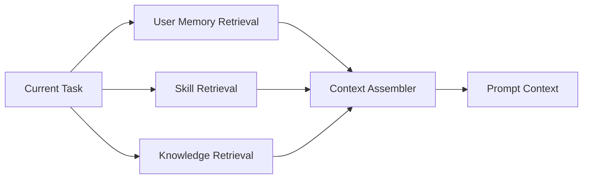
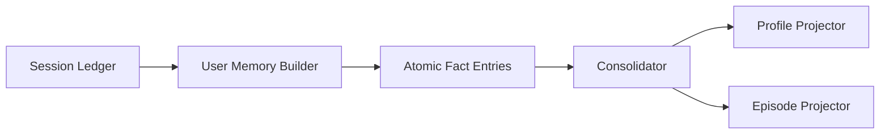
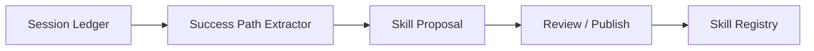

# Memory System Reset - Technical Design

## Design Summary

The current system is over-generalized. The final architecture will stop modeling memory as four parallel
product types and instead separate concerns by domain:

- `User Memory`: long-term personal facts
- `Skill Learning`: reusable successful paths and learned know-how
- `Knowledge Base`: shared company knowledge and documents
- `Session Ledger`: internal provenance only

This is not a compatibility refactor. It is a destructive reset.

## Final Product Model

### 1. User Memory

The only true memory product.

Purpose:
- remember stable personal facts
- remember relevant personal history
- support personalization and factual recall

Content model:
- preference
- identity
- relationship
- experience
- skill
- goal
- constraint
- event

### 2. Skill Learning

The replacement for agent memory.

Purpose:
- learn reusable successful paths
- capture applicability and failure avoidance
- publish to the skill system

Product surface:
- `skill proposals`
- reviewed/published `skills`

### 3. Knowledge Base

The replacement for company memory.

Purpose:
- store documents
- shared references
- organizational procedures
- manuals and structured knowledge artifacts

### 4. Session Ledger

Internal only.

Purpose:
- provenance
- extraction substrate
- debugging/rebuild support

Not a product view.

## Final Runtime Context Model

Runtime context assembly becomes:

Removed from runtime:
- `company_memories`
- `agent_memories`
- `task_context_memories`

Replaced with:
- `user_memory`
- `skills`
- `knowledge_refs`

## Final Data Model

## Tables To Drop

These tables belong to the old architecture and should be removed:

- `memory_records`
- `memory_acl`
- `memory_sessions`
- `memory_session_events`
- `memory_observations`
- `memory_materializations`
- `memory_entries`
- `memory_links`

Reason:
- they encode either the old generic product model or the transitional compatibility layer
- we do not need to preserve old naming or old ownership semantics

## Tables To Create

### 1. `session_ledgers`

Internal session provenance root.

Columns:
- `id`
- `session_id`
- `user_id`
- `agent_id`
- `started_at`
- `ended_at`
- `status`
- `end_reason`
- `metadata`
- `created_at`
- `updated_at`

### 2. `session_ledger_events`

Ordered events inside one session ledger.

Columns:
- `id`
- `session_ledger_id`
- `event_index`
- `event_kind`
- `role`
- `content`
- `event_timestamp`
- `payload`
- `created_at`

### 3. `user_memory_entries`

The durable atomic memory table.

Columns:
- `id`
- `user_id`
- `entry_key`
- `fact_kind`
- `canonical_text`
- `summary`
- `predicate`
- `object_text`
- `event_time`
- `location`
- `persons`
- `entities`
- `topic`
- `confidence`
- `importance`
- `status`
- `source_session_ledger_id`
- `source_event_indexes`
- `entry_data`
- `superseded_by_id`
- `created_at`
- `updated_at`

Indexes:
- `(user_id, fact_kind, status)`
- `(user_id, entry_key)` unique
- GIN/JSON indexes where useful for persons/entities

### 4. `user_memory_links`

Lineage and supersession links.

Columns:
- `id`
- `user_id`
- `source_entry_id`
- `target_entry_id`
- `link_type`
- `link_data`
- `created_at`

Primary use:
- superseded-by
- derived-from
- consolidated-with

### 5. `user_memory_views`

Stable projections for product/UI.

Columns:
- `id`
- `user_id`
- `view_type`
- `view_key`
- `title`
- `content`
- `view_data`
- `status`
- `updated_at`
- `created_at`

Required view types:
- `profile`
- `episode`

### 6. `skill_proposals`

Learned skill candidates extracted from session outcomes.

Columns:
- `id`
- `agent_id`
- `user_id`
- `proposal_key`
- `title`
- `goal`
- `successful_path`
- `why_it_worked`
- `applicability`
- `avoid`
- `evidence_session_ledger_id`
- `confidence`
- `review_status`
- `review_note`
- `published_skill_id`
- `proposal_data`
- `created_at`
- `updated_at`

## Storage and Indexing

### User Memory

Keep:
- PostgreSQL as source of truth
- Milvus as vector index if semantic retrieval remains needed

Reset:
- delete old multi-collection memory layout
- create one user-memory vector collection only

Target collection:
- `user_memory_entries`

Drop:
- `agent_memories`
- `company_memories`
- related old partitions

### Skills

Do not use the memory vector store as the source of truth.

Use:
- existing skill registry tables for published skills
- `skill_proposals` for learned-but-not-published proposals

### Knowledge Base

No architecture change beyond removing company-memory overlap.

## Final Write Pipelines

## Pipeline A: User Memory

### User Memory Builder

SimpleMem-style principles:
- context-independent restatement
- resolved time references
- complete coverage of valuable facts
- no product/UI-shaped extraction contract

Builder output unit:
- one fact/event per atomic entry

Rules:
- one entry should express one semantic unit
- all time-sensitive facts should try to normalize `event_time`
- relationship and experience facts must be directly answerable from one entry

### Consolidator

Responsibilities:
- exact dedupe
- semantic near-duplicate merge
- supersession
- quality filtering
- stale/noisy entry suppression

### Projectors

`profile` projector:
- stable facts only
- no noisy event stream

`episode` projector:
- important timed facts
- relocations, career changes, milestones

## Pipeline B: Skill Learning

Rules:
- trigger only on evidence of successful completion or validated useful path
- keep failed attempts only as `avoid` or diagnostic evidence inside proposal
- do not store output as user-facing memory

Published output:
- existing skill system entities

## Session Ledger Retention

Session ledger is internal and ephemeral.

Retention behavior:
- keep short operational window only
- default 14 days
- delete ledger rows after extraction/consolidation window
- keep durable user memory entries and skill proposals

Deletion contract:
- deleting session ledger must not delete durable user memory entries or skill proposals

## API Design

## APIs To Delete

Delete generic memory product APIs that encode old type semantics:

- generic `/api/v1/memories` CRUD and search endpoints
- agent-candidate review endpoints under `/memories`
- type-driven list/search interfaces using `agent/company/user_context/task_context`

## New APIs

### User Memory

- `GET /api/v1/user-memory/search`
- `GET /api/v1/user-memory/profile`
- `GET /api/v1/user-memory/episodes`
- `GET /api/v1/user-memory/config`
- `PUT /api/v1/user-memory/config`
- `POST /api/v1/user-memory/admin/rebuild`
- `POST /api/v1/user-memory/admin/cleanup-ledger`
- `POST /api/v1/user-memory/{entry_id}/suppress`

### Skill Learning

- `GET /api/v1/skill-proposals`
- `POST /api/v1/skill-proposals/{proposal_id}/review`
- `POST /api/v1/skill-proposals/{proposal_id}/publish`

### Keep Existing

- existing KB APIs
- existing Skills APIs for published skills

## Frontend Design

## Pages To Remove or Repurpose

- generic `Memory` page with multi-type filters
- company memory views
- agent memory candidate views inside generic memory UI

## New Frontend Surfaces

### User Memory

Sections:
- profile
- episodes
- raw facts
- config

### Skill Learning

Sections:
- proposals awaiting review
- learned skills already published

### Knowledge Base

No company-memory duplication in the memory UI.

## Configuration Design

## Config Sections To Remove

- old `memory` type-driven configuration that assumes agent/company/task scopes

## New Config Sections

### `user_memory`

Subsections:
- `embedding`
- `extraction`
- `retrieval`
- `consolidation`
- `observability`

### `skill_learning`

Subsections:
- `extraction`
- `publish_policy`

### `session_ledger`

Subsections:
- `enabled`
- `retention_days`
- `run_on_startup`
- `startup_delay_seconds`
- `cleanup_interval_seconds`
- `batch_size`
- `dry_run`

### `runtime_context`

Subsections:
- `enable_user_memory`
- `enable_skills`
- `enable_knowledge_base`

### `knowledge_base`

Keep existing KB config ownership there.

## Backend Module Plan

## Delete

These modules are explicitly legacy or transitional and should be removed:

- `backend/memory_system/memory_system.py`
- `backend/memory_system/memory_interface.py`
- `backend/memory_system/memory_repository.py`
- `backend/memory_system/legacy_memory_compat_service.py`
- `backend/memory_system/session_memory_builder.py`
- `backend/memory_system/materialization_retrieval_service.py`
- `backend/memory_system/materialization_maintenance_service.py`
- `backend/memory_system/materialization_maintenance_manager.py`
- `backend/memory_system/retrieval_gateway.py`
- `backend/memory_system/collections.py`
- `backend/memory_system/partitions.py`
- memory backfill/diagnostic scripts tied to old product types

## Replace With

New modules:

- `backend/user_memory/session_ledger_repository.py`
- `backend/user_memory/session_ledger_service.py`
- `backend/user_memory/user_memory_builder.py`
- `backend/user_memory/user_memory_repository.py`
- `backend/user_memory/user_memory_retriever.py`
- `backend/user_memory/user_memory_consolidator.py`
- `backend/user_memory/user_memory_projector.py`
- `backend/user_memory/session_ledger_retention_manager.py`
- `backend/skill_learning/skill_proposal_builder.py`
- `backend/skill_learning/skill_proposal_repository.py`
- `backend/skill_learning/skill_proposal_service.py`
- `backend/agent_framework/context_sources.py`

## Runtime Refactor

Replace old memory-scope retrieval in [agent_executor.py](/Users/youqilin/VIbeCodingProjects/linX/backend/agent_framework/agent_executor.py#L618)
with a source-based context assembler:

- `user_memory`
- `skills`
- `knowledge_refs`

Remove:
- `resolve_memory_scopes`
- agent/company/task memory debug buckets
- old `AgentMemoryInterface`

## Destructive Migration Procedure

1. Stop backend services.
2. Delete old memory-related Milvus collections and partitions.
3. Drop old memory tables.
4. Apply fresh migration chain for:
   - session ledger
   - user memory
   - skill proposals
5. Clear old memory scripts and feature flags.
6. Rebuild backend with new routers and runtime context assembly.
7. Run fresh bootstrap and targeted test suite on empty DB.

No backfill and no compatibility window.

## Test Strategy

## Delete Tests That Encode Old Product Semantics

Delete or replace tests asserting:
- memory type = `agent`
- memory type = `company`
- memory type = `task_context`
- agent candidate review under generic memory APIs
- company memory sharing behavior
- legacy materialization compatibility

## Required New Test Groups

### User Memory

- builder extracts relationship / experience / event facts
- profile projector keeps stable facts only
- episode projector keeps timed events
- retrieval answers factual and temporal queries
- retention cleanup preserves durable entries

### Skill Learning

- success-path extraction creates skill proposals
- review/publish updates proposal state
- publishing creates/updates skill registry entries

### Runtime

- context assembly injects only user memory + skills + KB
- no company/agent/task memory buckets remain

### API

- user-memory endpoints
- skill-proposal endpoints
- config endpoints for user_memory / skill_learning

## Risks

1. Scope creep if old compatibility paths are allowed to survive
2. Hidden runtime coupling to old `MemoryType`
3. Frontend filters and analytics still assuming old type buckets
4. Skills and knowledge retrieval overlapping without clear prompt assembly rules

## Mitigations

1. Delete legacy modules early in the implementation sequence
2. Delete obsolete tests before adding new ones
3. Reset config names, not only config values
4. Make runtime debug output source-based, not memory-type-based
